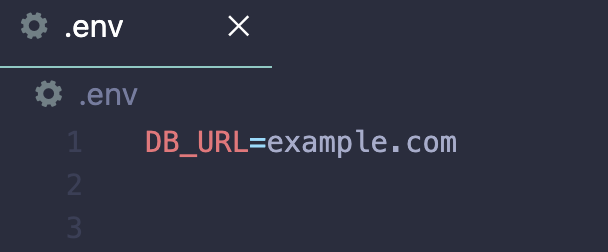

# Exercise 5 - huMONGOus DB

## Description
Practice setting up a MongoDB database, using Mongoose, and performing CRUD operations.

## Submission
Collect points for this exercise by pushing your completed `models` folder and `operations.js` file to GitHub.
- Due Date: **3-2-23**

## Instructions
The pet shelter **We Heart Dogs** needs a way to keep track of information about the **dogs** in their facility. Currently, they keep track of all their data in a single Excel spreadsheet. 

They want to keep track of each dog's name, age, breed, date they entered the shelter, and date adopted. 

1. Start by brainstorming an architecture for this database. Think of the collections you may need and what each document may look like (fields, values, etc). 
2. Once you have your db architecture, start creating schemas for each of your collections in the `models` folder. 
3. Lastly, implement the functions which perform CRUD operations in `operations.js` using the model(s) you created in `models`. 

## Code Tour
This exercise involves architecting a database based on a fictional prompt and performing certain queries on the db. 

1. Make sure to **Sync Fork** on GitHub, so your repo is up-to-date and has a `exer5` folder
2. Pull the new changes onto your local repo (`git pull origin main`)
3. Open the `exer5/` folder inside VS Code
4. Start by installing all required pacakges using `npm install`
5. Create and setup a new database in your MongoDB Atlas Cluster
6. In the `exer5/` folder create a file named `.env`. Put the following text in this file, but use your MongoDB connection string from Atlas:

7. You will see a `utils/db.js` file. This file contains a function to establish a connection with the db. You will need to change the **connection url string** to your db url found in MongoDB Atlas. 
8. You will see a `models` folder. You will put your schema files in here. 
9. You will see an `operation.js` file. This is where you will write your CRUD operation functions to query the db.
10. You will see an `index.js` file. This is where the functions you implemented in `operations.js` are called. 
11. Make sure run `node index.js` and see if your functions are giving you the expected output outlined in the `operations.js` function details. 
12. Start coding!
13. You can run your code with the command `node index.js`
